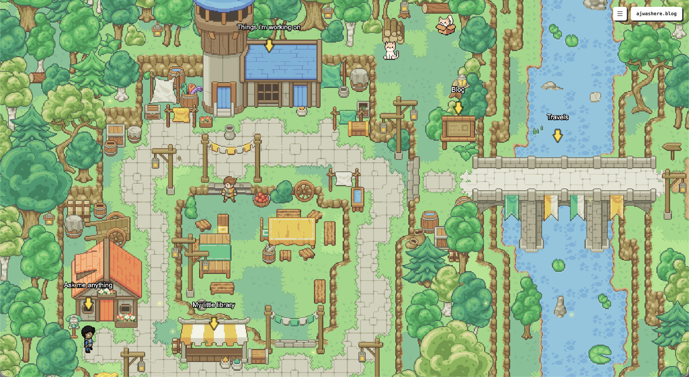

# ajwashere.blog

[](https://react.dev)
[](https://www.typescriptlang.org)
[](https://phaser.io)
[](https://vite.dev)

**[Visit the live site](https://ajwashere.blog)**



A Pokemon-style overworld as a personal website. Visitors control a sprite, walk around, and discover content by exploring a floating island village — not clicking nav links.

## The Experience

- **Top-down pixel art world** with Game Boy / SNES era aesthetic
- **WASD / arrow keys** to move your character
- **Press E** to interact with buildings and objects
- **Lo-fi background music** sets the mood
- Explore the island to find Projects, Reading List, Blog, and Travels

## Tech Stack

- **React 19** + TypeScript
- **Phaser 3** game engine
- **Vite 7** for dev/build
- **Bun** as package manager
- **Tiled** for map design (Fantasy Tileset Premium)

## Development

```bash
# Install dependencies
bun install

# Start dev server
bun dev

# Build for production
bun run build

# Preview production build
bun run preview
```

## Credits

- Tileset: [Fantasy Tileset Premium](https://itch.io) from itch.io
- Character sprites: Various itch.io artists
- Music: Lo-fi background track
